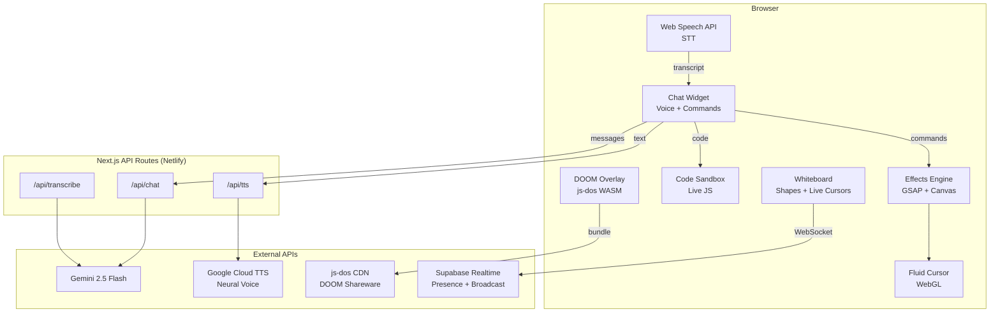

# Daniel Duque — AI Portfolio

An AI-powered interactive portfolio built with Next.js 16, featuring a conversational AI assistant that can control the website in real time.

**Live site:** [duque.ai](https://duque.ai)

## Features

### AI Chatbot (Gemini 2.5 Flash)
- Conversational assistant that answers questions about Daniel's experience, skills, and projects
- Persona-driven system prompt with detailed work history and project context
- Multi-turn conversation with message history (up to 20 messages of context)

### Visual Command System
The chatbot can control the website in real time through a custom command protocol. The AI includes `[COMMAND:{...}]` tags in its responses, which the frontend parses and executes:

| Command | Description |
|---|---|
| `changeBackground` | Change the page background color (updates CSS custom properties across all sections) |
| `changeAccent` | Change the accent/brand color |
| `changeText` | Change the main text color |
| `toggleCursor` | Enable/disable the WebGL fluid cursor effect |
| `fireworks` | Launch a fireworks particle animation (GSAP + canvas) |
| `confetti` | Throw confetti across the screen |
| `snow` | Snowfall effect |
| `matrix` | Matrix-style raining code |
| `disco` | Cycling background colors |
| `shake` | Shake the page |
| `scrollTo` | Smooth-scroll to any section (about, work, testimonials, contact) |
| `highlight` | Scroll to and glow-highlight a specific project card |
| `showCode` | Render an interactive code sandbox with the AI's code |
| `showDiagram` | Display the site's architecture diagram |
| `generatePitch` | Show a "Download Resume" CTA after a tailored pitch |
| `playDoom` | Launch playable DOOM (1993) in the browser |
| `reset` | Restore all effects to defaults |

### Voice Chat
- **Speech-to-Text:** Web Speech API with continuous mode and 2-second silence debounce
- **Text-to-Speech:** Google Cloud TTS with neural voice (en-US-Journey-D) for natural-sounding responses
- Mic button with pulsing red animation while listening
- "Speaking..." indicator on messages being read aloud
- Interrupts TTS when starting a new voice input
- Code responses are automatically excluded from TTS

### Interactive Code Sandbox
- AI generates code that renders in an editable textarea with line numbers
- **Run** button executes JavaScript in a sandboxed iframe with captured `console.log`
- **Copy** button for clipboard access
- Output panel shows logs (green) and errors (red)
- 3-second execution timeout for infinite loop protection
- Auto-detects code in AI responses (fenced blocks, `<code>` elements, or unfenced code patterns)
- Chat panel expands to 50vw on desktop when code is displayed

### AI-Tailored Pitch
- Detects when visitors describe hiring needs ("I'm looking for a React lead")
- Generates a focused 2-3 paragraph pitch mapping Daniel's experience to the role
- Renders a glowing "Download Resume" CTA button with the pitch

### Smart Navigation
- `scrollTo` smoothly scrolls to any section
- `highlight` finds a project card by name, scrolls to it, and applies a 2-second orange glow effect
- Fuzzy matching on project titles

### Real-Time Collaborative Whiteboard
- Custom-built whiteboard with **Supabase Realtime** for live collaboration
- **Shape tools:** Freehand draw, rectangle, circle, line, arrow, text
- **Live cursors:** See other users' cursor positions with name labels in real time
- **Color picker:** 8 colors, per-user assignment
- **Selection & move:** Click to select shapes, drag to reposition
- **Undo** (Cmd/Ctrl+Z), **Delete**, **Clear mine**
- **Export:** Save as PNG or copy to clipboard
- **Name prompt:** Enter your name before joining — displayed on your cursor for others
- **Presence tracking:** Live user count badge on the whiteboard icon
- Ephemeral — drawings persist as long as at least one user has the page open

### Easter Eggs
- **WarGames + DOOM:** Ask to play a game and the AI follows the WarGames script ("How about a nice game of Global Thermonuclear War?"), then launches playable DOOM shareware via js-dos WebAssembly emulator

## Architecture



## Tech Stack

- **Framework:** Next.js 16 (App Router), React 19, TypeScript
- **Styling:** Tailwind CSS 4, CSS custom properties
- **Animations:** GSAP with ScrollTrigger, custom canvas effects
- **AI:** Google Gemini 2.5 Flash, Google Cloud TTS
- **Voice:** Web Speech API (STT), Google Cloud TTS (response)
- **Realtime:** Supabase Realtime (Presence + Broadcast)
- **Deployment:** Netlify (with edge functions)
- **Other:** js-dos (DOOM emulator), smokey-fluid-cursor (WebGL)

## Getting Started

### Prerequisites
- Node.js 22+
- npm

### Environment Variables

Create a `.env.local` file:

```bash
GEMINI_API_KEY=your_gemini_api_key
GOOGLE_TTS_API_KEY=your_google_cloud_tts_api_key
NEXT_PUBLIC_SUPABASE_URL=https://your-project.supabase.co
NEXT_PUBLIC_SUPABASE_ANON_KEY=your_supabase_anon_key
```

- **Gemini API key:** Get from [Google AI Studio](https://aistudio.google.com/apikey)
- **TTS API key:** Enable [Cloud Text-to-Speech API](https://console.cloud.google.com/apis/library/texttospeech.googleapis.com) in Google Cloud Console, then create an API key under Credentials
- **Supabase:** Create a free project at [supabase.com](https://supabase.com), copy the Project URL and anon key from Settings → API

### Development

```bash
npm install
npm run dev
```

Open [http://localhost:3000](http://localhost:3000).

### Build

```bash
npm run build
```

## Project Structure

```
src/
├── app/
│   ├── api/
│   │   ├── chat/route.ts          # Gemini chat endpoint
│   │   ├── tts/route.ts           # Google Cloud TTS endpoint
│   │   └── transcribe/route.ts    # Audio transcription endpoint
│   ├── layout.tsx                 # Root layout with SiteEffectsProvider
│   ├── page.tsx                   # Main page
│   └── globals.css                # Theme variables, global animations
├── components/
│   ├── ChatWidget.tsx             # Chat UI, voice, command dispatch
│   ├── CodeSandbox.tsx            # Live code editor + runner
│   ├── EffectsOverlay.tsx         # Canvas overlay for visual effects
│   ├── DoomOverlay.tsx            # DOOM emulator overlay
│   ├── WhiteboardButton.tsx       # Whiteboard trigger + name prompt + presence
│   ├── WhiteboardOverlay.tsx      # Collaborative whiteboard canvas
│   ├── ArchitectureDiagram.tsx    # SVG architecture diagram
│   ├── FluidCursor.tsx            # WebGL fluid cursor (toggleable)
│   ├── Hero.tsx                   # Hero section with GSAP animations
│   ├── FeaturedProjects.tsx       # Featured projects grid
│   └── ...                        # Other page sections
├── context/
│   └── SiteEffectsContext.tsx     # Global effects state (colors, cursor, active effect)
├── data/
│   ├── chatContext.ts             # System prompt for Gemini
│   └── projects.ts               # Project data
├── lib/
│   ├── commandRegistry.ts        # Command parser, validator, handlers
│   ├── supabase.ts               # Supabase client
│   ├── animations.ts             # GSAP animation utilities
│   └── effects/                   # Visual effect modules
│       ├── fireworks.ts
│       ├── confetti.ts
│       ├── matrix.ts
│       ├── snow.ts
│       └── disco.ts
└── types/
    ├── index.ts
    └── speech.d.ts                # Web Speech API type declarations
```

## License

All rights reserved. This is a personal portfolio project.
